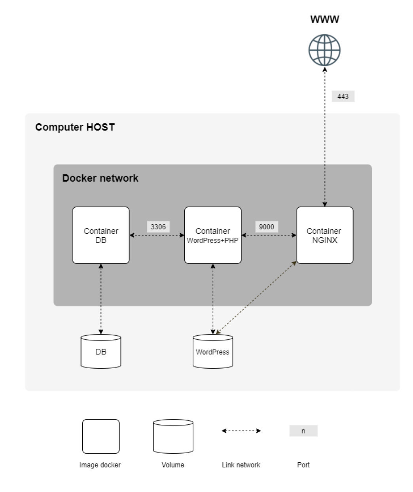

# Inception

このプロジェクトでは、VirtualBox内でDockerfileでWordpress, Nginx, MariaDBイメージを作成し、そのイメージを使ってDocker Composeでコンテナを作成しました。

## 開発及び実行環境

Xubuntu 18.04 (VirtualBox)

## 構成



## 使い方

リポジトリをクローンし、makeコマンドでコンテナを起動します。  
setupにsudo コマンドが使われるので、パスワードを入力して下さい。

```bash
# リポジトリクローン
git clone https://github.com/TaiyouSekiguchi/Inception.git
cd Inception

# setup, コンテナ起動
make
```

起動後、[https://tsekiguc.42.fr](https://tsekiguc.42.fr) にGoogle Chromeでアクセスします。  
オレオレ証明書のため、アクセスが拒否されますが、Chromeにフォーカスがあたっている状態で  
*thisisunsafe*と入力して下さい。アクセスが成功し、Wordpressが表示されます。
